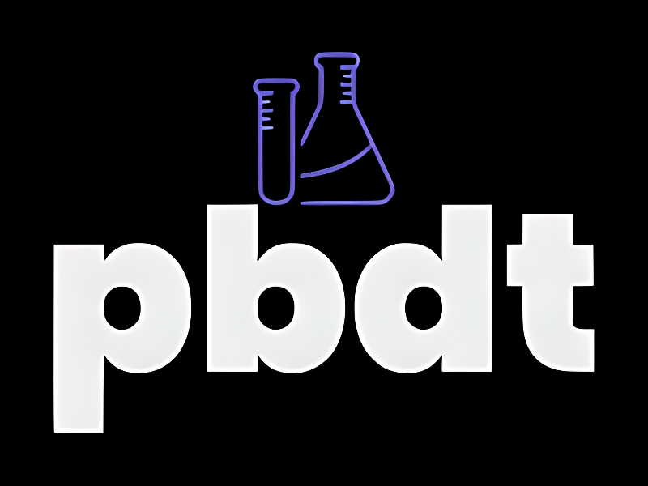

<div align="center">
    <h1>
        
        <p><i>Property-Behavior Driven Test for C++</i></p>
    </h1>


</div>

```cpp
#include <array>

#include "pbdt/bdd.hpp"

int main()
{
    constexpr auto target = [](int x) -> int
    {
        return x + 0;
    };
    constexpr auto prop = [](int x, int result)
    {
        return pbdt::test_context::expect(x == result);
    };
    constexpr auto domain = std::array<int, 5>{ 1, 2, 3, 4, 5 };

    static_assert(pbdt::bdd::scenario(target, prop, domain).passable());

    return 0;
}
```

## 🚀 Features
- 🔍 **Property-based testing** in **BDD** format
- 🧩 Supports **C++20 modules** for modern and modular development

## 🛠️ Getting Started

To build and test the project, follow these steps:

1. **Set up dependencies**:
    - Install [CMake](https://cmake.org/), [Ninja](https://ninja-build.org/), [vcpkg](https://github.com/microsoft/vcpkg), and [Conan](https://conan.io/).

2. **Configure and build the project**:
    ```bash
    cmake --preset <preset-name>
    cmake --build --preset <preset-name>
    ```

    Replace `<preset-name>` with one of the supported presets:
    - `x64-debug`, `x64-release` (Windows)
    - `linux-debug`, `linux-release` (Linux)
    - `macos-debug`, `macos-release` (macOS)

3. **Run tests**:
    ```bash
    ctest --preset <preset-name> --output-on-failure
    ```

## 🤝 Contributing

Contributions are welcome! Please fork the repository and submit a pull request with your changes.

## 📜 License

This project is licensed under the MIT License. See the [LICENSE](LICENSE) file for details.
